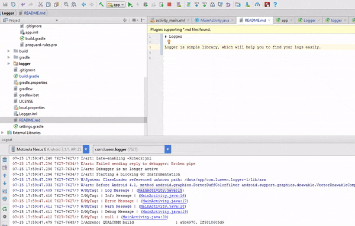

# Logger

Logger is simple library, which will help you to find your logs easily.



# Setup and usage
-----------------------
## Step 1:
Init logger in Application onCreate method

```java
    @Override
    public void onCreate() {
        super.onCreate();

        new Logger.Builder()
                .isLoggable(BuildConfig.DEBUG)
                .logType(LogType.WARN)
                .tag("MyTag")
                .build();
    }
```
-----------------------
 ```java
 isLoggable(BuildConfig.DEBUG)
 ```
  - set if app should print logs or not
-----------------------
 ```java
 logType(LogType.WARN)
 ```
 - default log type when print

 ```java
 Logger.log("Log Message");
 ```
-----------------------

 ```java
 tag("MyTag")
 ```
 Default log tag


## Step 2:

 Usage

 ```java
 Logger.log("Log Message");
 Logger.i("Info Message");
 Logger.e("Error Message");
 Logger.w("Warn Message");
 Logger.d("Debug Message");
 Logger.e(null);
 Logger.e("Error Message with ThrowAble", new Throwable("Some Error"));
 ```


## Contact

Pull requests are more than welcome.

- **Email**: chatikyana@gmail.com
- **Facebook**: https://web.facebook.com/chatikyana
- **Twitter**: https://twitter.com/ArmanChatikyan
- **Google +**: https://plus.google.com/+ArmanChatikyan
- **Website**: https://armcha.github.io/
- **Medium**: https://medium.com/@chatikyan

License
--------

      Logger
      Copyright (c) 2017 Arman Chatikyan (https://github.com/armcha/logger).

      Licensed under the Apache License, Version 2.0 (the "License");
      you may not use this file except in compliance with the License.
      You may obtain a copy of the License at

         http://www.apache.org/licenses/LICENSE-2.0

      Unless required by applicable law or agreed to in writing, software
      distributed under the License is distributed on an "AS IS" BASIS,
      WITHOUT WARRANTIES OR CONDITIONS OF ANY KIND, either express or implied.
      See the License for the specific language governing permissions and
      limitations under the License.